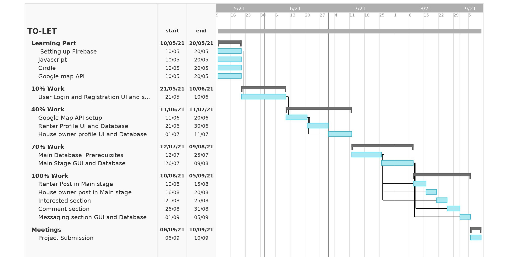

# G12-To-let

Expected Timeline
-----------------

Report on Learning Pre-requisites
---------------------------------
SL | Learning Task | Description | Status | Comment |
--:|:--------------|:------------|:------:|---------|
1  | Tools    | Setting up Android studio and Firebase |   | both |
2  | Basics | HTML, CSS , Javascript|   | both |
3 | Android Fundamentals | Android widgets, Activity, Intent, Manu, Adapter, View, Fragment, Android layout, Style, ActionBar, Android Data storage | | both|
4 | API | Android API | | both | 
5 | Map | Google Map | | both |   
  
Used Technologies
--------
- Android Studio
- Firebase Realtime database
- Firebase Storage
- Java
- HTML  
  
  
**Platform:**
Android
  

Implemented Feature
-----------
- Registration and login of users
- E-mail verification is necessary before login
- Implemented Firebase Authentication library for all kinds of authentication
- Implemented Firebase Realtime Database as the DBS(Database SYSTEM)
- Storing the location from which user is registering their new accounts, which can be used by admins later on for many purposes including verification of their owned rental homes
- Adding To-let:
  1. Selecting To-let location:
     - Full Interactive map with dedicated button to show current location of User
     - Selecting current location
     - Long pressing the map to bring a marker(has house icon), the markers position selects the to-let location
     - We can drag the marker to change the selected house location or to adjust the selected location properly
     - Passing both user current location and selected location
  2. Editing House location details and storing to database:
     - We can give almost all house details with provided Edit fields
     - **This page also shows the selected house location with interactive map**
     - **Street adress for the house is auto generated base on the house location with the help of Geocoder**
     - If we give any invalid info it shows details of error corresponding to the field where the error occured
     - **Detects whether the provided House Name/To-let name is unique among all the House names belonging to that user**
     - Unique Id of the house is created in combination of the user Id and the house name and this unique house Id is used as key of the house
     - **The Unique house key along with the location is stored with as hashcode with the help og GeoFire library**
     - All information are stored in Firebase
     - **Checks whether the user was far away from the house while adding the house to determine whether the house is verified or not**
- Searching To-let:
  1. Selecting location around which search will be conducted:
     - Full Interactive map with dedicated button to show current location of User
     - Selecting current location
     - Long pressing the map to bring a marker(has person icon), the markers position selects search location
     - We can drag the marker to change the selected search location or to adjust the selected location properly
  2. Search results showing and filtering;
     - We can select the radius, with which we will conduct the search
     - We can Filter the search with the help of various fields
     - The filter fields also have error checking system
     - Resulting houses are showed on the map with a house icon
     - tapping on a house icon will show a short description of the house along with its verification status
     - All resulted houses are shown as a Scrollable list with short description
- Internet connection check is performed whenever internet connection is necessary and prompts the user through a dialog box to connect to the internet by taking them to the Wifi setting if they select so
- We can always get updated Database snapshot throughout the application by accessing the static member variable mDatabaseInfoHelper of HouseInfo class which is initialized at the start of the app
- Post about house on the timeline
- Scrollable timeline with posts from all user
- Changing profile picture
- Some unmentioned minor features 
  
  
Unemplemented Features
--------
- Messaging system (chat section)
- Edit or delete to-let and whole proflie information
- Full house details related Activity and UI which will be shown upon clicking details icon in the ScrollView. Implementation of this feature is to be added at line 399
  inside overriden onClick method inside addHouseCard method of SearchResultMapsActivity.java file
- In Timeline there some small feature are not properly implemented (those are properly documented in codebase)
- Password recovery if user forget password

Implemented Feature
-----------
Detailed report can be found here at [Report.pdf](https://github.com/Shrestha30/To-let/blob/main/Report.pdf).
  
Acknowledgement
---------------
Special thanks to:  
- Our respectable teacher and project supervisor  
  **Enamul Hassan  
  Assistant Professor  
  Dept. of CSE, SUST**  
  for his valuable feedbacks, suggestion and supervision.  
- **Google** for their following libraries used in this project:  
  1. Google Map
  2. Geocoder
  3. Google Play services plugin  
- Google's **Firebase** for their following libraries in this project:  
  1. [Authentication](https://firebase.google.com/docs/auth/android/start)
  2. [Realtime Database](https://firebase.google.com/docs/database)
  3. [Cloud Storage](https://firebase.google.com/docs/storage/android/start)
- [GeoFire](https://github.com/firebase/geofire-android) library contributors. The library is published to Maven Central by the firebase-sonatype account.
- [Dexter](https://github.com/Karumi/Dexter) library contributors.
- **Bump Technologies** for their [Glide](https://github.com/bumptech/glide) library
- **Henning Dodenhof** for his [CircleImageView](https://github.com/hdodenhof/CircleImageView) library
- [SimCoder](https://www.youtube.com/c/SimpleCoder) YouTube channel owner for his various android and its technology related tutorials.
- 
Icons made by <a href="https://www.freepik.com" title="Freepik">Freepik</a> from <a href="https://www.flaticon.com/" title="Flaticon">www.flaticon.com</a>

Developers
-------
**Group number:**
12  
**Group Member Details:**  
1. **Name:**
[Md. Sumon Miah](https://github.com/MD-SUMON-MIAH)  
   **Registration Number:**
   2018331062  
      **Cell:**
      01739039844  
         **E-mail**
         sumonsnskhan@gmail.com
2. **Name:**
[Shrestha Datta](https://github.com/Shrestha30)  
   **Registration Number:**
   2018331030  
      **Cell:**
      01933941050  
         **E-mail**
         shresthadatta910@gmail.com

<small>&copy;2021 - Dept. of CSE, SUST, BD</small>
